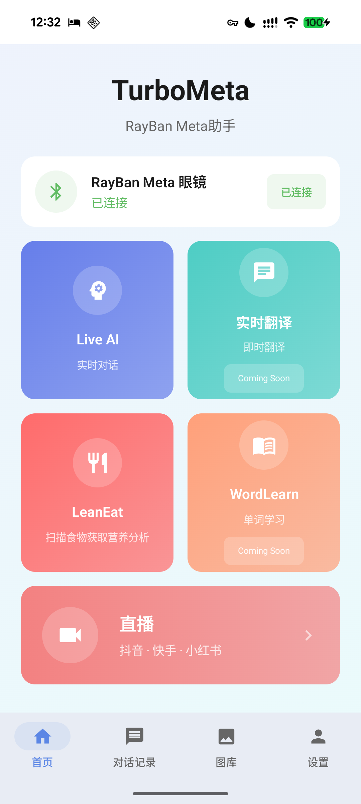
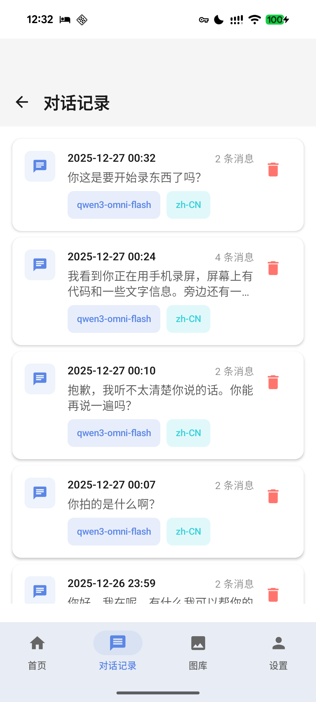
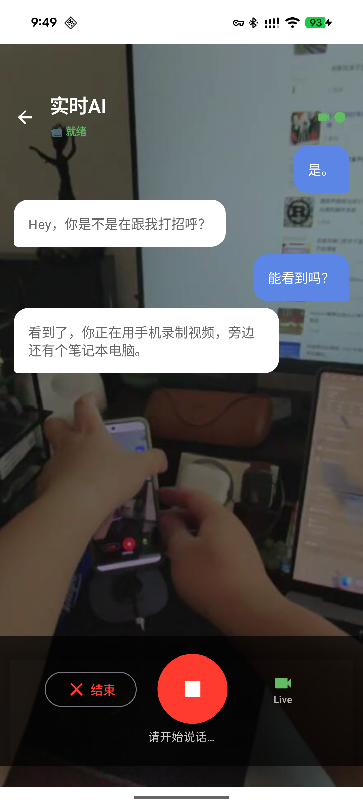
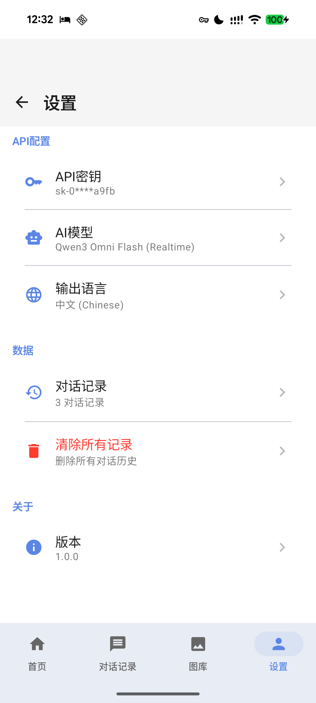

# TurboMeta - RayBan Meta Smart Glasses AI Assistant

<div align="center">


**🌏 World's First Full-Chinese AI Multimodal RayBan Meta Assistant**

[](https://www.apple.com/ios/)
[](https://www.android.com/)
[](https://swift.org)
[](https://kotlinlang.org)
[](LICENSE)
[](https://buymeacoffee.com/turbo1123)

[English](./README_EN.md) | [简体中文](./README.md)

</div>

---

> **Disclaimer**: This is an open-source project providing source code only for developers to learn and study. We do **NOT** provide any pre-built binaries for download, do NOT support any method of bypassing official app store distribution, and will NOT respond to any inquiries related to unofficial distribution or sideloading. iOS users should build the project using Xcode following standard Apple development workflows. This project strictly complies with all terms of the [Apple Developer Program License Agreement](https://developer.apple.com/support/terms/).

---

## 🎉 Major Update v2.0.0

<div align="center">

### 🔗 OpenClaw Integration + Meta Ray-Ban Display Support

**Voice chat, photo recognition, OpenClaw AI assistant — your glasses, connected to everything!**

✅ **iOS v2.0.0** | 📱 **Android v1.5.0**

☕ **Enjoying this project?** [**Buy me a coffee**](https://buymeacoffee.com/turbo1123) to support development!

</div>

### 🆕 v2.0 New Features

- 🔗 **OpenClaw Integration**: Connect your glasses to [OpenClaw](https://openclaw.ai) AI assistant — snap photos & voice chat 👉 [Setup Guide](#-openclaw-integration)
- 🕶️ **Meta Ray-Ban Display Support**: Added support for Meta Ray-Ban Display glasses (DAT SDK v0.5.0)
- 🎙️ **Real-time Speech Recognition**: OpenClaw chat supports Alibaba Fun-ASR voice-to-text
- 🛡️ **Stability Improvements**: Fixed memory leaks and thread safety issues

### 🎯 Core Features

- 🔗 **OpenClaw AI Assistant**: Connect to OpenClaw Gateway, chat with AI using glasses photos 👉 [Setup Guide](#-openclaw-integration)
- 🎬 **RTMP Live Streaming**: Stream to any RTMP platform — YouTube, Twitch, Bilibili, Douyin, TikTok, Facebook Live, etc.
- 👁️ **Quick Vision**: Siri voice activation - identify objects without unlocking your phone
- 🤖 **Live AI**: Real-time multimodal AI conversation via glasses camera and microphone
- 🍽️ **LeanEat**: Take a photo to get nutrition analysis and health scores

### 🌐 Multi-Language & Multi-Platform

- 🌐 **Bilingual Interface**: Full English and Chinese UI support with easy switching
- 🔌 **OpenRouter Support**: Access 500+ AI models including GPT-5, Claude 4.5, Gemini 3, and more
- 🎙️ **Google Gemini Live**: Live AI now supports Google Gemini real-time voice chat (requires non-China network)
- 🌏 **Alibaba Multi-Region**: Support for Beijing (China mainland) and Singapore (International) endpoints
- 🔑 **Independent API Key Management**: Separate API keys for different providers and regions

---

## 📱 Quick Vision

<div align="center">

### 🚀 Background Wake-up + Siri Voice Trigger!

**No need to unlock your phone - just say a word and let AI identify everything in front of you**

</div>

Due to Meta DAT SDK limitations, the app cannot directly access the glasses camera in the background. We innovatively combined **Siri Shortcuts + App Intent + Alibaba Cloud TTS** to achieve this feature:

- 📱 **Siri Voice Wake-up**: Just say "Hey Siri, TurboMeta Quick Vision"
- ⌚ **Action Button Trigger** (iPhone 15 Pro+): One-tap Quick Vision
- 🔊 **Voice Result Announcement**: High-quality TTS powered by qwen3-tts-flash
- 🎯 **Fully Automated**: Start stream → Capture → Stop stream → AI Recognition → TTS Announcement

👉 [View Detailed Tutorial](#quick-vision-tutorial)

---

## 🎨 Interface Preview

<table>
  <tr>
    <td align="center"><b>首页</b><br/>Home</td>
    <td align="center"><b>对话记录</b><br/>Live AI</td>
    <td align="center"><b>拍摄页面</b><br/>Camera</td>
    <td align="center"><b>设置页面</b><br/>Settings</td>
  </tr>
  <tr>
    <td></td>
    <td></td>
    <td></td>
    <td></td>
  </tr>
</table>

## 🎬 Video Demo

<a href="https://www.bilibili.com/video/BV1aTqSBHEqN" target="_blank">
  
</a>

👉 <a href="https://www.bilibili.com/video/BV1aTqSBHEqN" target="_blank">Watch on Bilibili</a>

> 💡 If you find this project helpful, consider [**buying me a coffee**](https://buymeacoffee.com/turbo1123) ☕

## 📥 Get the Source Code

> ⚠️ **Note**: This is an open-source project. The iOS version provides source code only — users should build the project using Xcode following standard Apple development workflows. Android users can download the APK from the Releases page.

### ⚠️ Important: Enable Meta DAT SDK Preview Mode First!

Before using TurboMeta, you **MUST** enable DAT SDK Preview Mode in Meta View App (this is unrelated to iOS Developer Mode):

1. **Update RayBan Meta glasses firmware to version 20+** (required for DAT SDK)
2. **Update Meta View App to the latest version**
3. Open **Meta View App** (or **Meta AI App**) on your phone
4. Go to **Settings** → **App Info**
5. Find **Version Number**
6. **Tap the version number 5 times rapidly**
7. A confirmation message will appear

> This is required by Meta Wearables DAT SDK (currently in Preview). See Meta's official documentation for details.

---

### 🍎 iOS — Build from Source

> ✅ Supports bilingual UI, OpenRouter, Gemini, RTMP streaming, OpenClaw integration
>
> ⚠️ **We do NOT provide pre-built binaries (IPA) for download.** Please build from source using Xcode.

#### Step 1: Register with Meta Wearables

1. Go to [Meta Wearables Developer Center](https://wearables.developer.meta.com/)
2. Sign up and log in
3. Click **Projects** → **Create Project**
4. Go to **App configuration** page
5. Under **Application ID integration** → **iOS integration**, copy `MetaAppID` and `ClientToken`
6. Open `CameraAccess/Info.plist` and fill in your values under `MWDAT`:

```xml
<key>MWDAT</key>
<dict>
    <key>AppLinkURLScheme</key>
    <string>turbometa://</string>
    <key>MetaAppID</key>
    <string>YOUR_META_APP_ID</string>
    <key>ClientToken</key>
    <string>YOUR_CLIENT_TOKEN</string>
    <key>TeamID</key>
    <string>$(DEVELOPMENT_TEAM)</string>
</dict>
```

#### Step 2: Build and Run

1. Open `CameraAccess.xcodeproj` with **Xcode 15.0+**
2. Select your Apple ID and Team in Signing & Capabilities
3. Connect your iPhone, click Run
4. Configure your Alibaba Cloud API Key in Settings 👉 [See Configuration Guide](#api-key-config)

### 📱 Android

> ⚠️ Android is currently at v1.5.0 and does not yet include v2.0 features (OpenClaw, Meta Ray-Ban Display).

👉 [**Download APK**](https://github.com/Turbo1123/turbometa-rayban-ai/releases)

**Installation:**
1. Download the APK file
2. Enable "Install from unknown sources" in Settings
3. Open APK to install
4. Grant permissions (Bluetooth, Microphone)
5. Configure API Key in Settings 👉 [See Configuration Guide](#api-key-config)

---

## 📖 Introduction

TurboMeta is a full-featured multimodal AI assistant built exclusively for RayBan Meta smart glasses, powered by Alibaba Cloud's Qwen multimodal AI models:

- 🎯 **Live AI Conversations**: Real-time multimodal interaction through glasses camera and microphone
- 🍎 **Smart Nutrition Analysis**: Capture food photos and get detailed nutritional information and health recommendations
- 👁️ **Image Recognition**: Intelligently identify objects, scenes, and text in your field of view
- 🎥 **Live Streaming**: Stream directly to platforms like Douyin, Kuaishou, and Xiaohongshu
- 🌐 **Full Chinese Support**: Complete Chinese AI interaction experience, perfectly tailored for Chinese users

This is the world's first **fully Chinese-enabled** RayBan Meta AI assistant, bringing the convenience of smart glasses to Chinese-speaking users.

## ✨ Core Features

### 👁️ Quick Vision <sup>`NEW`</sup>
- **Siri Wake-up**: Voice-triggered recognition without unlocking your phone
- **Shortcuts Integration**: Supports iOS Shortcuts automation
- **Action Button Support**: One-tap trigger on iPhone 15 Pro series
- **High-quality TTS**: Voice announcement powered by qwen3-tts-flash
- **Smart Recognition**: Based on qwen3-vl-plus multimodal visual understanding

### 🤖 Live AI - Real-time Conversations
- **Multimodal Interaction**: Simultaneous voice and visual input support
- **Real-time Response**: Based on Qwen Omni-Realtime model with low-latency voice conversations
- **Scene Understanding**: AI can see what's in front of you and provide relevant suggestions
- **Natural Responses**: Smooth and natural Chinese conversation experience
- **One-tap Hide**: Support for hiding conversation interface to focus on visual experience

### 🍽️ LeanEat - Smart Nutrition Analysis
- **Food Recognition**: Identify food types by taking photos
- **Nutritional Content**: Detailed data on calories, protein, fat, carbohydrates, etc.
- **Health Scoring**: Health scoring system from 0-100
- **Nutrition Advice**: Personalized nutritional recommendations from AI
- **Beautiful Interface**: Carefully designed UI with clear nutritional information display

### 📸 Real-time Photography
- **Auto-start**: Automatically connects to glasses and starts preview when opened
- **Multi-function Integration**: Choose nutrition analysis or AI recognition after taking photos
- **Smooth Experience**: Real-time video stream preview

### 🎥 Live Streaming
- **Platform Support**: Compatible with mainstream live streaming platforms
- **Clean Interface**: Pure view focused on streaming content

## 🛠️ Tech Stack

### iOS
- **Platform**: iOS 17.0+
- **Language**: Swift 5.0 + SwiftUI
- **SDK**: Meta Wearables DAT SDK v0.5.0
- **Architecture**: MVVM + Combine
- **Audio**: AVAudioEngine + AVAudioPlayerNode

### Android
- **Platform**: Android 8.0+ (API 26)
- **Language**: Kotlin 1.9 + Jetpack Compose
- **SDK**: Meta Wearables DAT SDK v0.4.0
- **Architecture**: MVVM + StateFlow
- **UI**: Material 3 Design

### AI Models
- **Qwen Omni-Realtime**: Real-time multimodal conversations
- **Qwen VL-Plus**: Visual understanding and image analysis
- **Qwen TTS-Flash**: High-quality Chinese text-to-speech

## 📋 Requirements

### Hardware Requirements
- ✅ Ray-Ban Meta Smart Glasses or **Meta Ray-Ban Display** (newly supported)
- ✅ iPhone (iOS 17.0+) or Android phone (8.0+)
- ✅ Stable internet connection

### Software Requirements
- ✅ Meta View App / Meta AI App (for pairing glasses)
- ✅ Alibaba Cloud account (for API access)
- ✅ Xcode 15.0+ (iOS development)
- ✅ Android Studio (Android development)

### API Requirements
You need to apply for the following Alibaba Cloud APIs:
1. **Qwen Omni-Realtime API**: For real-time conversations
2. **Qwen VL-Plus API**: For image recognition and nutrition analysis

👉 [Apply for APIs at Alibaba Cloud Model Studio](https://www.alibabacloud.com/zh/product/modelstudio) | [Model Studio Console](https://bailian.console.alibabacloud.com/)

## 🚀 Installation Guide

### Step 1: Enable Meta DAT SDK Preview Mode

⚠️ **Important**: Since the Meta Wearables DAT SDK is currently in Preview, you must enable Preview Mode in Meta View App (this is unrelated to iOS Developer Mode).

1. Open **Meta View App** (or **Meta AI App**) on your iPhone
2. Go to **Settings** → **App Info** or **About**
3. Find **Version Number**
4. **Tap the version number 5 times consecutively**
5. A confirmation message will appear

### Step 2: Configure API Key

For detailed configuration guide, see 👉 [API Key Configuration](#api-key-config)

Quick steps:
1. Visit [Alibaba Cloud Model Studio](https://www.alibabacloud.com/zh/product/modelstudio) to register
2. Login to [Model Studio Console](https://bailian.console.alibabacloud.com/) → API-KEY Management → Create API Key
3. Enter your API Key in App "Settings" → "API Key Management"
4. **International users**: Select **Singapore** region in "Settings" for better connectivity

### Step 3: Build the Project

1. Open `CameraAccess.xcodeproj` with Xcode
2. Select your development team (Team)
3. Modify Bundle Identifier (if needed)
4. Connect your iPhone
5. Click **Run** or press `Cmd + R`

### Step 4: Pair Your Glasses

1. Open Meta View App
2. Pair your RayBan Meta glasses
3. Ensure Bluetooth is enabled
4. Return to TurboMeta App and wait for connection success

## 📱 Usage Guide

### First-time Use

1. Launch TurboMeta App
2. Ensure RayBan Meta glasses are paired and turned on
3. Wait for device connection (status shown at top)
4. Select the feature you want to use

### Live AI Real-time Conversations

1. Tap the **Live AI** card on the home screen
2. Wait for connection success (green dot in upper right)
3. Start speaking, AI will respond in real-time
4. AI can see what's in front of you
5. Tap the 👁️ button to hide conversation history

**Tips**:
- Speak clearly and maintain appropriate distance
- Ask "What do you see?" to have AI describe the scene
- AI responds in concise Chinese

> ⚠️ **International Users**: In Settings → API Key Management, select **Singapore** region for Live AI. This uses the international WebSocket endpoint (`wss://dashscope-intl.aliyuncs.com`) for better connectivity outside China mainland.

### LeanEat Nutrition Analysis

1. Tap the **LeanEat** card on the home screen
2. Point at food and tap the camera button 📷
3. In photo preview, tap **Nutrition Analysis**
4. Wait for AI analysis to complete
5. View nutritional content, health score, and recommendations

**Use Cases**:
- Take photos before meals to understand nutritional content
- Track daily intake when on a fitness diet
- Learn about food nutrition

### Live Streaming

1. Tap the **Live Stream** card on the home screen
2. Wait for video stream to start
3. Create your streaming content
4. Tap stop button to end the stream

---

<a id="quick-vision-tutorial"></a>

## 👁️ Quick Vision Tutorial

Quick Vision allows you to quickly identify objects in front of you through Siri or Shortcuts without unlocking your phone.

### 📋 Prerequisites

1. ✅ TurboMeta App installed and API Key configured
2. ✅ RayBan Meta glasses paired and turned on
3. ✅ Open TurboMeta App once for first-time initialization

### 🔧 Setting Up Shortcuts

#### Method 1: Siri Voice Trigger

1. Open the **Shortcuts** app on iPhone
2. Tap **+** in the top right to create a new shortcut
3. Tap **Add Action**
4. Search for **TurboMeta** or **Turbo Meta**
5. Select **Quick Vision** action
6. Tap the shortcut name at the top to rename it (e.g., "Quick Vision", "What's This")
7. Tap **Done** to save

**How to Use**:
- Say "Hey Siri, Quick Vision" (or your custom shortcut name)
- AI will automatically capture, recognize, and announce the result

<details>
<summary>📸 Click to view setup screenshots</summary>

1. Search for TurboMeta in Shortcuts app
2. Add "Quick Vision" action
3. Rename the shortcut

</details>

#### Method 2: iPhone 15 Pro Action Button

If you have iPhone 15 Pro / 15 Pro Max / 16 series, you can bind Quick Vision to the Action Button:

1. Open **Settings** → **Action Button**
2. Select **Shortcut**
3. Choose your TurboMeta Quick Vision shortcut
4. Done!

**How to Use**:
- Long press the Action Button to trigger Quick Vision
- No need to unlock your phone - works while wearing glasses

#### Method 3: Lock Screen Widget

1. Long press on the lock screen to enter edit mode
2. Tap **Customize**
3. Add **Shortcuts** widget to the lock screen widget area
4. Select TurboMeta Quick Vision shortcut
5. Tap Done

**How to Use**:
- Tap the widget directly on the lock screen to trigger

### 🎯 Quick Vision Workflow

```
Siri/Shortcut Trigger
        ↓
   Start Video Stream
        ↓
   Auto Capture Photo
        ↓
   Stop Video Stream
        ↓
   AI Image Recognition (qwen3-vl-plus)
        ↓
   TTS Voice Announcement (qwen3-tts-flash)
```

### 💡 Tips

- **Ensure glasses are on**: Make sure glasses aren't in the charging case
- **Stay steady**: Keep your head stable while capturing
- **Good lighting**: Better recognition in well-lit environments
- **Wait for announcement**: Recognition takes a few seconds, wait patiently for voice announcement

### ⚠️ Troubleshooting

**Q: Why does it say "Glasses not connected"?**
- Ensure glasses are on and paired with Meta View App
- Make sure Meta DAT SDK Preview Mode is enabled in Meta View App
- Try reopening TurboMeta App

**Q: Why is there no sound?**
- Check if phone is on silent mode
- Check Bluetooth audio output settings
- TTS requires network connection (Alibaba Cloud service)

**Q: Can't find TurboMeta in Shortcuts?**
- Open TurboMeta App at least once after installation
- Try restarting your phone

---

## ⚙️ Configuration Options

### API Configuration

Configure in `VisionAPIConfig.swift`:

```swift
struct VisionAPIConfig {
    // Alibaba Cloud API Key
    static let apiKey = "sk-YOUR-API-KEY-HERE"

    // API Base URL (usually doesn't need modification)
    static let baseURL = "https://dashscope.aliyuncs.com"
}
```

### System Prompts

Customize AI response style in `OmniRealtimeService.swift`:

```swift
"instructions": "You are a RayBan Meta smart glasses AI assistant. Keep answers concise and conversational..."
```

## 🔧 Troubleshooting

### Q1: Glasses won't connect?

**Solutions**:
1. Ensure glasses are successfully paired in Meta View App
2. Check if Bluetooth is enabled
3. Restart TurboMeta App
4. Restart glasses (place in charging case)
5. Ensure Meta DAT SDK Preview Mode is enabled in Meta View App

### Q2: AI not responding or responding slowly?

**Solutions**:
1. Check if internet connection is stable
2. Verify API Key is correctly configured
3. Check if Alibaba Cloud API quota is sufficient
4. Review console logs for errors

### Q3: Nutrition analysis results inaccurate?

**Solutions**:
1. Ensure food photos are clear
2. Take photos in good lighting
3. Show food completely in frame
4. AI analysis is for reference only, not a substitute for professional nutritionists

### Q4: Xcode build fails or cannot run on device?

**Solutions**:
1. Ensure your iPhone is registered as a development device in Xcode
2. Verify your signing configuration in Xcode → Signing & Capabilities
3. Change the Bundle Identifier in Xcode project settings to avoid conflicts
4. Ensure you are signed in with a valid Apple ID in Xcode → Settings → Accounts

### Q5: Voice recognition inaccurate?

**Solutions**:
1. Ensure environment is relatively quiet
2. Speak clearly at moderate speed
3. Don't obstruct the microphone
4. Currently optimized for Chinese, other languages may be less accurate

## 🔗 OpenClaw Integration

TurboMeta supports connecting to [OpenClaw](https://openclaw.ai) — an open-source personal AI assistant. Through OpenClaw, you can snap photos with your glasses and have AI analyze them, or use voice-to-text to chat with AI.

### Features

- 📷 **Photo Capture**: One-tap to capture glasses view and send to OpenClaw AI
- 🎙️ **Voice Transcription**: Real-time speech-to-text via Alibaba Fun-ASR, auto-sent to AI
- ⌨️ **Text Chat**: Type messages directly to AI
- 🔄 **Auto-connect**: Saved configuration auto-connects on launch

> ⚠️ Due to Meta DAT SDK limitations, the glasses camera cannot be accessed in the background. Use the photo capture feature while the app is in the foreground.

### Setup

#### 1. Install and Start OpenClaw

```bash
curl -fsSL https://openclaw.ai/install.sh | bash
openclaw gateway install
```

#### 2. Configure Gateway for LAN Access

Edit `~/.openclaw/openclaw.json`:

```json
{
  "gateway": {
    "bind": "lan",
    "nodes": {
      "allowCommands": ["camera.snap", "camera.clip", "camera.list", "device.status", "device.info"]
    }
  }
}
```

Then restart: `openclaw gateway restart`

#### 3. Connect from App

1. Open TurboMeta → Settings → OpenClaw
2. Enter Gateway address (e.g., `192.168.1.100`) and port (`18789`)
3. Enter Gateway Token (found in the OpenClaw Dashboard URL)
4. Tap Connect

First connection requires device pairing approval:

```bash
openclaw devices list    # View pending devices
openclaw devices approve # Approve pairing
```

#### 4. Remote Access (Optional)

For accessing Gateway outside your LAN, use [Tailscale](https://tailscale.com/):

1. Install Tailscale on both the Gateway machine and your phone
2. Log in with the same Tailscale account on both devices
3. In the app, use the Tailscale-assigned IP (e.g., `100.x.x.x:18789`)

Tailscale creates an encrypted peer-to-peer tunnel — no public ports needed.

---

## 🔒 Privacy and Security

- ✅ All audio/video data is only used for AI processing
- ✅ No storage or upload of user privacy data
- ✅ API communications use HTTPS encryption
- ✅ Images and voice are retained only during session
- ✅ Follows industry best practices for data handling

## 🗺️ Roadmap

### ✅ Completed
- [x] Live AI real-time conversations
- [x] LeanEat nutrition analysis
- [x] Image recognition
- [x] Basic live streaming functionality
- [x] Bilingual Chinese/English support
- [x] Conversation history saving
- [x] One-tap hide conversations
- [x] **Android version released** 🎉
- [x] **Quick Vision** 🆕
  - [x] Siri Shortcuts integration
  - [x] App Intent support
  - [x] Alibaba Cloud TTS voice announcement
  - [x] iPhone Action Button support

### 🚧 In Progress
- [ ] Improve multilingual support
- [ ] Optimize UI/UX
- [ ] Performance optimization

### 📅 Planned
- [ ] Real-time translation feature
- [ ] WordLearn vocabulary learning
- [ ] Cloud conversation sync
- [ ] More live streaming platform support
- [ ] Offline mode
- [ ] Apple Watch companion app
- [ ] Android Quick Vision support

## 🤝 Contributing

Contributions, bug reports, and feature suggestions are welcome!

1. Fork this project
2. Create a feature branch (`git checkout -b feature/AmazingFeature`)
3. Commit your changes (`git commit -m 'Add some AmazingFeature'`)
4. Push to the branch (`git push origin feature/AmazingFeature`)
5. Open a Pull Request

## 📄 License

This project is based on modifications of original code from Meta Platforms, Inc. and follows the original project's license.

Some code copyright belongs to Meta Platforms, Inc. and its affiliates.

Please see [LICENSE](LICENSE) file for details.

## 🙏 Acknowledgments

- **Meta Platforms, Inc.** - For providing DAT SDK and original sample code
- **Alibaba Cloud Qwen Team** - For powerful multimodal AI capabilities
- **RayBan** - For excellent smart glasses hardware

## 🚀 How to Open Source This Project

### 1. Create GitHub Repository

```bash
# Create a new repository on GitHub website
# Then execute in your project directory:
git init
git add .
git commit -m "Initial commit: TurboMeta - RayBan Meta AI Assistant"
git branch -M main
git remote add origin https://github.com/your-username/your-repo.git
git push -u origin main
```

### 2. Protect Sensitive Information

✅ **Security Measures Implemented**:
- API Keys are no longer hardcoded in the source code
- Uses iOS Keychain for secure storage of user API Keys
- Users configure their own API Keys in the App Settings

⚠️ **Pre-release Checklist**:
```bash
# Search for potential sensitive information
grep -r "sk-" .
grep -r "API" . | grep -i "key"
```

### 3. Add .gitignore File

Create a `.gitignore` file in project root:

```gitignore
# Xcode
build/
*.pbxuser
*.mode1v3
*.mode2v3
*.perspectivev3
xcuserdata/
*.xccheckout
*.moved-aside
DerivedData/
*.hmap
*.xcuserstate
*.xcworkspace

# API Keys (extra protection)
**/*APIKey*.swift
**/APIKeys.swift
**/*Secret*.swift

# macOS
.DS_Store
```

### 4. Choose Open Source License

This project is based on Meta DAT SDK sample code and follows the original project's license. You can:
- Keep the same license as Meta's original project
- Choose MIT, Apache 2.0, or other permissive licenses for your code
- Acknowledge the original source code in the LICENSE file

<a id="api-key-config"></a>
### 5. User Configuration Instructions

⚠️ **Important Notice**: Users need to configure Alibaba Cloud API Key:

#### Step 1: Register Alibaba Cloud Account
Visit [Alibaba Cloud Model Studio](https://www.alibabacloud.com/zh/product/modelstudio) to register

#### Step 2: Get API Key
1. Login to [Model Studio Console](https://bailian.console.alibabacloud.com/)
2. Find "**API-KEY Management**" in the left menu
3. Click "**Create API Key**" to generate a key
4. Copy the generated API Key

#### Step 3: Configure in App
1. Open TurboMeta App
2. Go to "**Settings**" → "**API Key Management**"
3. Paste your API Key and save

> 🔒 **Security Note**: API Key is stored in iOS Keychain and Android EncryptedSharedPreferences, never exposed

## 🌟 If This Project Helps You

- ⭐️ Star the project
- 🐛 Report bugs or suggest features
- 🔀 Fork and contribute code
- 📢 Share with others

## ☕ Support the Project

If this project helps you, consider supporting development! Your support keeps this project alive and growing.

<div align="center">

<a href="https://buymeacoffee.com/turbo1123" target="_blank">
  
</a>

### ☕ [**Buy me a coffee**](https://buymeacoffee.com/turbo1123)

</div>

**Why support?**
- 🚀 Help fund new features and updates
- 🐛 Support ongoing bug fixes and maintenance
- 🌍 Enable more language support
- ❤️ Show appreciation for open source work

---

<div align="center">

**Making Smart Glasses Smarter 🕶️**

Made with ❤️ for RayBan Meta Users Worldwide

</div>
